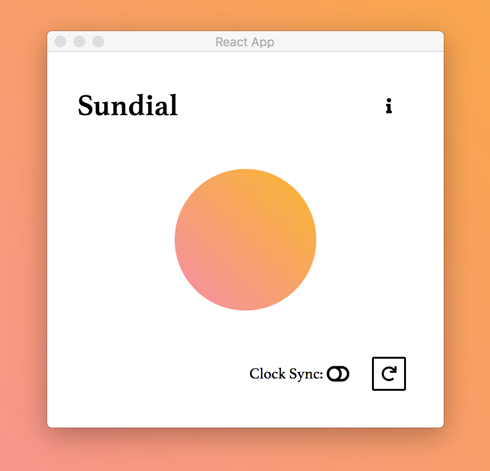

# Chronometer

Turn your background into a clock

### Build

Chronometer uses ImageMagick to create gradient images so running the development build requires ImageMagick installed.

To run the electron app:
```
npm i
npm start
```


